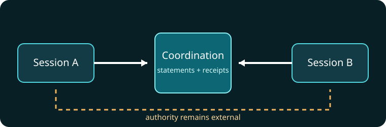

# Component boundary

Coordination owns durable signals, replay and explicit handoff semantics.

- Yukh MCP governs capability evaluation and execution.
- Yukh Projects reconciles reviewed portfolio and delivery state.
- External governance determines membership, authority and acceptance.

Message delivery cannot grant a capability. A claim cannot change project
state. An attached digest proves bytes, not their truth.

